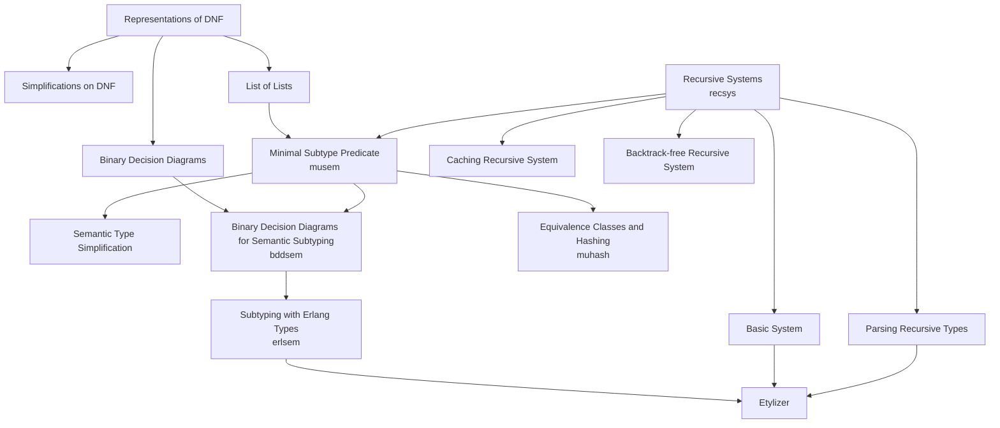

```mermaid
graph TD;
    dnf[Representations of DNF]-->bdd;
    dnf-->dnfsimpl[Simplifications on DNF];
    dnf-->lol[List of Lists];
    lol-->musem;
    musem-->semsimpl[Semantic Type Simplification];
    bdd[Binary Decision Diagrams]-->bddsem;
    recsys[Recursive Systems<br>recsys]-->musem[Minimal Subtype Predicate<br>musem];
    recsys-->recbasic[Basic System];
    recsys-->reccache[Caching Recursive System];
    recsys-->recbacktrack[Backtrack-free Recursive System];
    recsys-->parse[Parsing Recursive Types];
    musem-->muhash[Equivalence Classes and Hashing<br>muhash];
    musem-->bddsem[Binary Decision Diagrams for Semantic Subtyping<br>bddsem];
    bddsem-->erlsem[Subtyping with Erlang Types<br>erlsem];
    erlsem-->etylizer[Etylizer];
    recbasic-->etylizer;
    parse-->etylizer;
```
